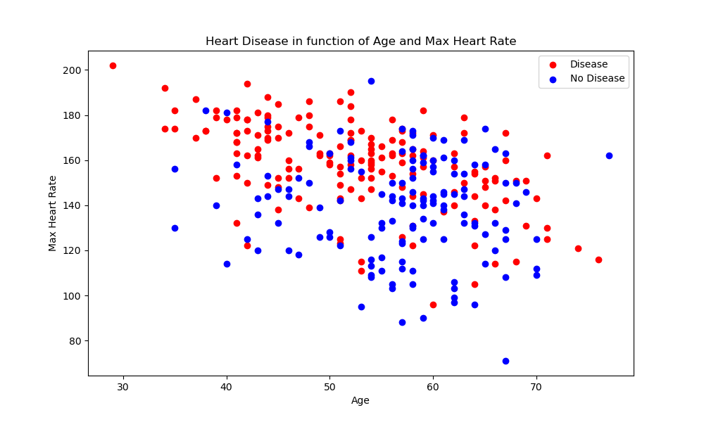
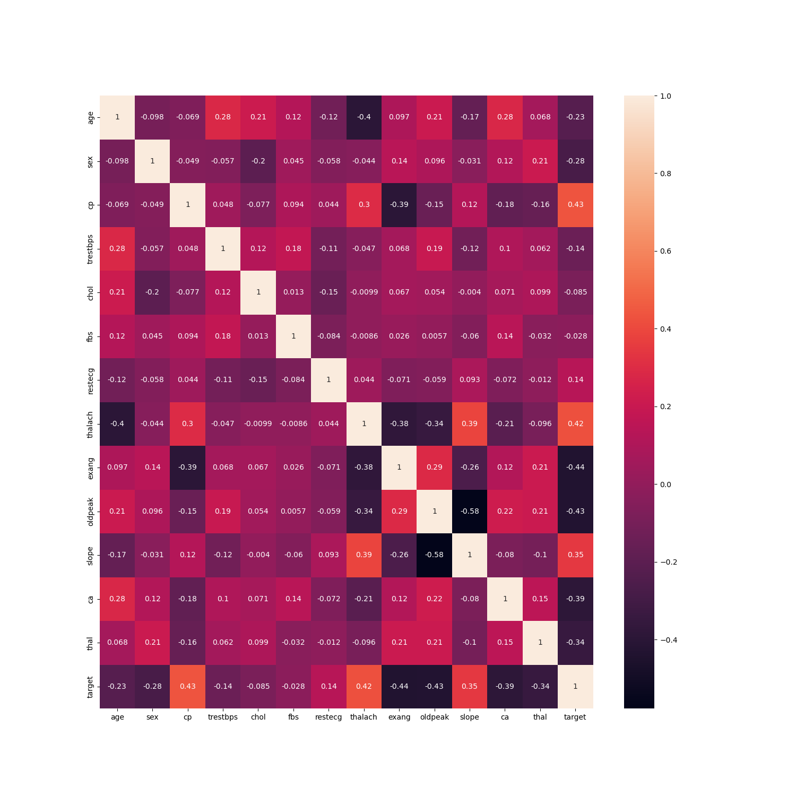
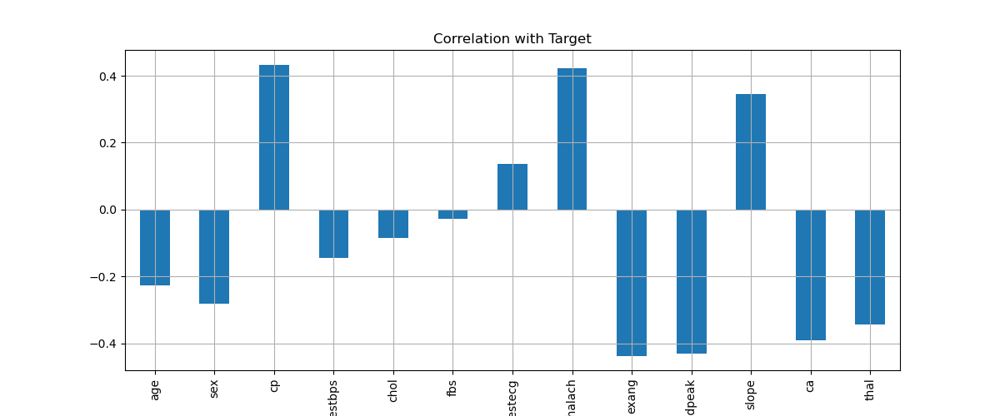
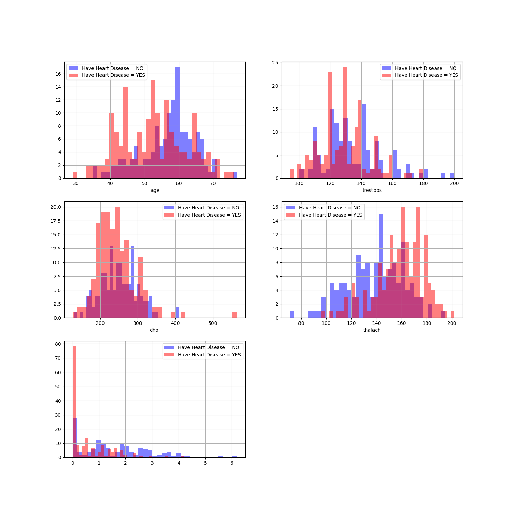

# Heart Disease Prediction using Logistic Regression

## Project Overview

This project focuses on predicting the likelihood of heart disease using a **`Logistic Regression model`**. The model uses a dataset that includes various health-related features to predict whether a patient is likely to have heart disease or not. The project also includes comprehensive visualizations to support data exploration and model understanding.

---

## Data Visualizations

To gain deeper insights into the dataset, several key visualizations were created. These plots help in identifying important features, correlations, and the relationship between variables.

### 1. Age vs. Heart Rate Scatter Plot

This scatter plot illustrates the relationship between age and heart rate, providing insights into how age impacts heart rate, which could be an important factor in predicting heart disease.



### 2. Correlation Matrix of Columns

The correlation matrix visualizes the strength and direction of relationships between different columns in the dataset. This helps to identify which features are most correlated with the target variable (heart disease).



### 3. Correlation Bar Plot with Target

The correlation bar plot highlights the correlation between the features and the target variable. This visualization is useful for identifying the most influential features for predicting heart disease.



### 4. Histogram of Categorical Values 

This histogram shows the distribution of  categorical variables in the dataset. It helps to visualize the frequency of values in each feature.



### 5. Histogram of Continuous Values 

Another histogram showing the distribution of continuous  values in the dataset, further aiding in understanding data distribution and feature importance.


---

## Technologies Used

- **Programming Language**: `Python`
- **Libraries**:
  - **`Pandas`** and **`NumPy`** for data manipulation.
  - **`Matplotlib`** and **`Seaborn`** for data visualization.
  - **`Scikit-learn`** for building and evaluating the Logistic Regression model.

---

## How to GEt the Project into your machine/System

1. Clone the repository:
   ```bash
   git clone <repository-url>
